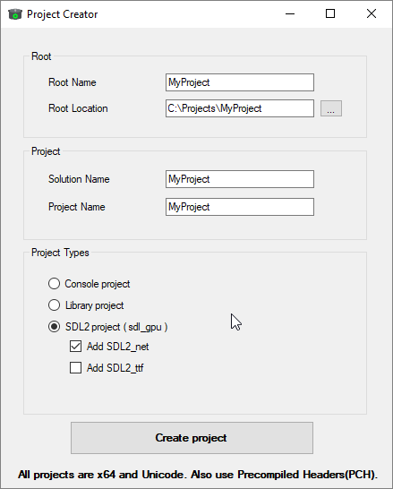
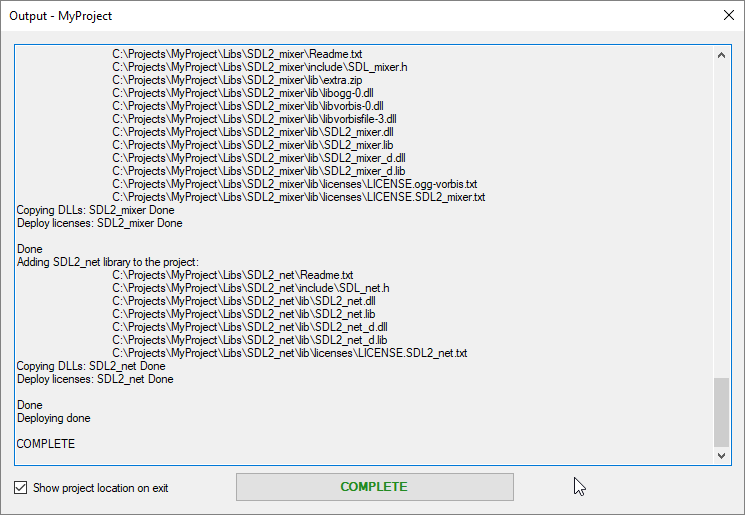
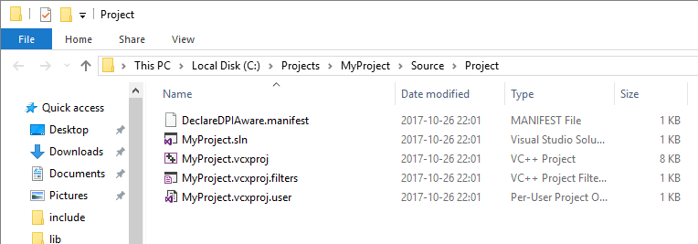

# ProjectCreate

A project I started due to the time it takes to setup a programming project with all settings configured. Why not create my own project creator? The obvious advantage is the speed and ease to which it takes to generate a project from scratch. From time to time I am thinking to remake this project with C++, espesially since I have just resently made my first prototype GUI made with SFML.

Tags: C#
